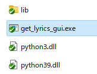
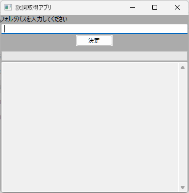
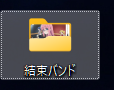
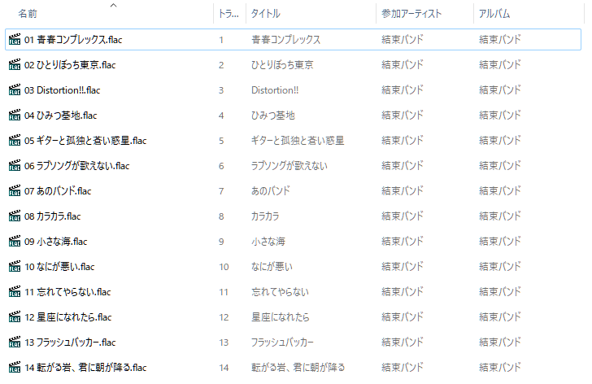
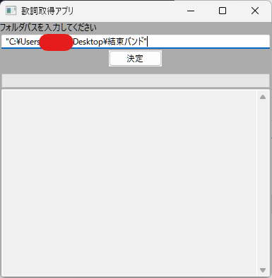
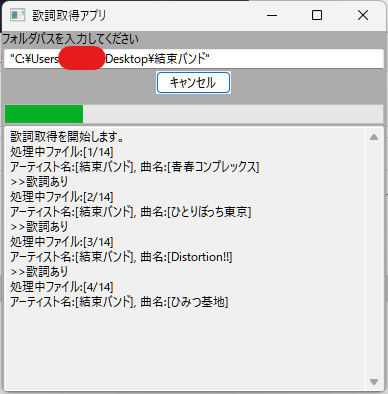
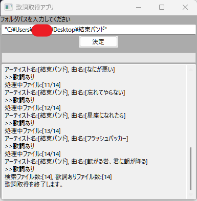
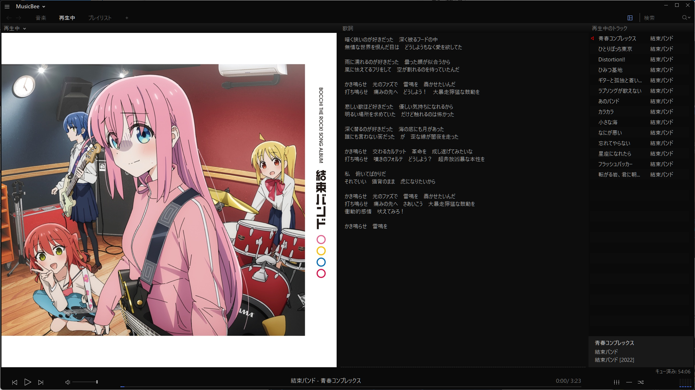

# 歌ネットから歌詞を取得して音楽ファイルに埋め込むアプリ

**歌ネット歌詞ダウンローダー Uta-Net Lyrics Downloader**

## 概要

Pythonの音楽ファイルのタグを編集できるライブラリ「mutagen」と、Webスクレイピングを行うためのライブラリ「beautifulsoup4」を使って、[歌ネット](https://www.uta-net.com/)で歌詞を取得して、音楽ファイルに自動で歌詞を埋め込むアプリです。

## 動作環境

| 環境               | 条件                                                         |
| ------------------ | ------------------------------------------------------------ |
| 音楽ジャンル       | 邦楽のみでジャンル問わず<br />※歌ネットに洋楽の歌詞はありません |
| 音楽ファイル拡張子 | .mp3 .m4a .flac                                              |

## ダウンロード

最新バージョンv1.0.0.0のダウンロードは[こちら]()

## 使い方

1. zipファイルをダウンロードし、解凍します。

2. 以下のフォルダごと好きな場所に移動させて構いません。  
   ```
   /build/Uta-Net Lyrics Downloader
   ```

3. 上記フォルダ内の`get_lyrics_gui.exe`をダブルクリックして起動します。  
   

4. 起動した画面です。  
   

5. `フォルダパスを入力してください`の部分に歌詞を埋め込みたい音楽ファイルの入ったフォルダパスを入力します。  
   例えば、私はデスクトップにおいたこのフォルダ👇を指定します。  
     
   中身はこんな感じです👇  
     
   指定した画面👇  
     
   ※パスの前後に`"`があっても大丈夫です。

6. `決定`ボタンを押すと、処理が始まります。  
     

7. 処理完了  
       
   検索したファイル数が`検索ファイル数`に、そのうち歌詞を取得して音楽ファイルに埋め込まれたファイル数が`歌詞ありファイル数`に表示されます。

8. 私は[MusicBee](https://www.getmusicbee.com/)で音楽を聴いています。MusicBeeで歌詞を表示するとこんな感じでしっかり表示されます。  
       
   JSON形式でメタ情報を書き出すとこうなっています(**Lyrics**の部分👇)。  

   ```json
   {
   "creatingLibrary": {
   "name": "MediaInfoLib",
   "version": "21.09",
   "url": "https://mediaarea.net/MediaInfo"
   },
   "media": {
   "@ref": "C:\\Users\\-----\\Desktop\\結束バンド\\01 青春コンプレックス.flac",
   "track": [
   {
   "@type": "General",
   "AudioCount": "1",
   "FileExtension": "flac",
   "Format": "FLAC",
   "FileSize": "48128103",
   "Duration": "203.906",
   "OverallBitRate_Mode": "VBR",
   "OverallBitRate": "1888247",
   "StreamSize": "0",
   "Album_ReplayGain_Gain": "-12.23",
   "Album_ReplayGain_Peak": "0.994623",
   "Title": "青春コンプレックス",
   "Album": "結束バンド",
   "Album_Performer": "結束バンド",
   "Track": "青春コンプレックス",
   "Track_Position": "1",
   "Track_Position_Total": "14",
   "Performer": "結束バンド",
   "Producer": "Aniplex",
   "Genre": "Anime",
   "Recorded_Date": "2022",
   "File_Created_Date": "UTC 2023-02-17 01:10:07.299",
   "File_Created_Date_Local": "2023-02-17 10:10:07.299",
   "File_Modified_Date": "UTC 2023-02-17 01:15:41.588",
   "File_Modified_Date_Local": "2023-02-17 10:15:41.588",
   "Encoded_Application": "Lavf58.29.100",
   "Cover": "Yes",
   "Cover_Mime": "image/jpeg",
   "Lyrics": "暗く狭いのが好きだった　深く被るフードの中 / 無情な世界を恨んだ目は　どうしようもなく愛を欲してた /  / 雨に濡れるのが好きだった　曇った顔が似合うから / 嵐に怯えてるフリをして　空が割れるのを待っていたんだ /  / かき鳴らせ　光のファズで　雷鳴を　轟かせたいんだ / 打ち鳴らせ　痛みの先へ　どうしよう！　大暴走獰猛な鼓動を /  / 悲しい歌ほど好きだった　優しい気持ちになれるから / 明るい場所を求めていた　だけど触れるのは怖かった /  / 深く潜るのが好きだった　海の底にも月があった / 誰にも言わない筈だった　が　歪な線が闇夜を走った /  / かき鳴らせ　交わるカルテット　革命を　成し遂げてみたいな / 打ち鳴らせ　嘆きのフォルテ　どうしよう？　超奔放凶暴な本性を /  / 私　俯いてばかりだ / それでいい　猫背のまま　虎になりたいから /  / かき鳴らせ　光のファズで　雷鳴を　轟かせたいんだ / 打ち鳴らせ　痛みの先へ　さあいこう　大暴走獰猛な鼓動を / 衝動的感情　吠えてみろ！ /  / かき鳴らせ　雷鳴を"
   },
   {
   "@type": "Audio",
   "Format": "FLAC",
   "Duration": "203.906",
   "BitRate_Mode": "VBR",
   "BitRate": "1873773",
   "Channels": "2",
   "ChannelPositions": "Front: L R",
   "ChannelLayout": "L R",
   "SamplingRate": "48000",
   "SamplingCount": "9787488",
   "BitDepth": "24",
   "Compression_Mode": "Lossless",
   "ReplayGain_Gain": "-12.64",
   "ReplayGain_Peak": "0.988836",
   "StreamSize": "47759194",
   "StreamSize_Proportion": "0.99233",
   "Encoded_Library": "Lavf58.29.100"
   }
   ]
   }
   }
   ```

## 最後に

Webスクレイピングをすることで、色んな情報をネット上から自動でとって取れるようになるので、結構いろんなことに使えそうです。また、何か思いついたらこんな感じの簡単なアプリを作ろうと思います。
